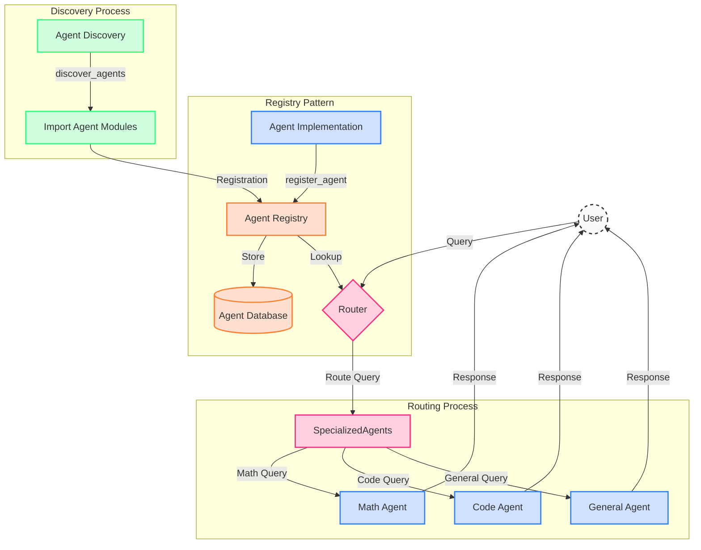
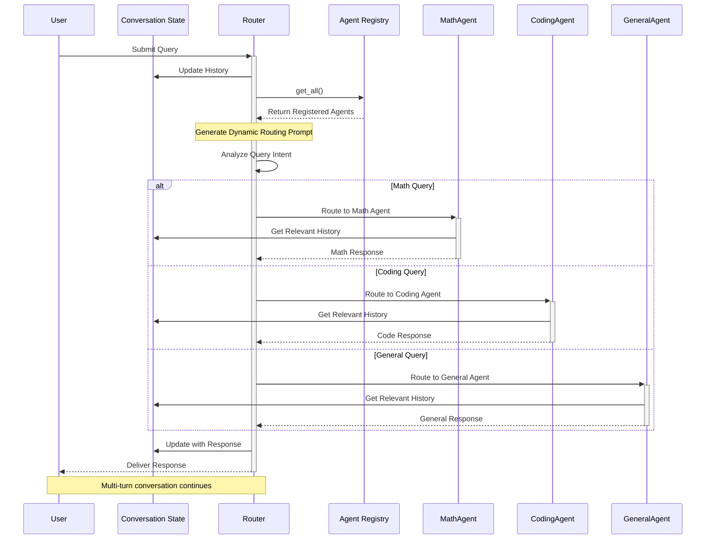

# MultiAgentRegistryKit

<div align="center">

*The Registry Pattern for AI: Simplifying Agent Creation, Connection, and Collaboration with Intelligent Routing*

[](https://opensource.org/licenses/MIT)
[](https://www.python.org/downloads/)
[](CONTRIBUTING.md)
[](https://github.com/psf/black)
[](README.md)

</div>

Welcome to MultiAgentRegistryKit!

Ever wished your LLM-powered agents could collaborate smartly, modularly, and be easily extended?

Meet MultiAgentRegistryKit — your lightweight, extensible framework for building intelligent multi-agent systems with supervised routing and a powerful registry pattern under the hood.

## 🚀 What is it?
MultiAgentRegistryKit is a plug-and-play framework that helps you:

- 🧠 Route user intent to the right agent via a Router Agent
- 🧩 Register and discover agents dynamically using an AgentRegistry
- ⚙️ Add new agents easily with minimal boilerplate
- 🔄 Build scalable, modular, and production-ready multi-agent workflows

Whether you're building a smart assistant, workflow automation tool, or a research prototype — this kit has your back.

## 🔧 Key Features
- ✅ Router Agent for intelligent request routing
- ✅ Registry Pattern for agent discovery and plug-in architecture
- ✅ Composable Design – bring your own agents
- ✅ Supports LangChain / LangGraph or standalone implementations
- ✅ Built with extensibility and clarity in mind

## 📦 Use Cases
- AI assistants with multiple specialized agents
- Workflow orchestration with LLMs
- Research experiments with custom routing logic
- Developer tools for multi-agent experimentation

## 📋 Overview

MultiAgentRegistryKit is an intelligent routing system that directs user queries to specialized agents based on the query content. This project demonstrates how to build a multi-agent system with:

- **Router Agent**: Routes queries to the appropriate specialized agent
- **Specialized Agents**:
  - **Math Agent**: Handles mathematical problems and calculations
  - **Coding Agent**: Addresses programming questions and code generation
  - **General Agent**: Responds to general knowledge queries

## Features

- **Intelligent Query Routing**: Automatically determines the most appropriate agent for each query
- **Conversation State Management**: Maintains context across multi-turn conversations
- **Modular Design**: Easily extend with new specialized agents
- **Built on Amazon Bedrock**: Leverages Claude 3 Haiku for natural language understanding
- **LangChain Integration**: Uses LangChain's abstractions for simplified agent development

## Prerequisites

- Python 3.8+
- AWS account with access to Amazon Bedrock
- Appropriate IAM permissions for Bedrock API calls

## Quick Start

1. **Install the package**
```bash
pip install multi-agent-registry-kit
```

2. **Configure AWS credentials**
```bash
aws configure
```

3. **Run the interactive agent**
```bash
# Using the installed package
python -m src.main

# Or using the entry point script
python main.py
```

## Development Setup

1. **Clone the repository**
```bash
git clone https://github.com/AnuragVikramSingh/multi-agent-registry-kit.git
cd multi-agent-registry-kit
```

2. **Create and activate a virtual environment**
```bash
# Create a virtual environment
python -m venv venv

# Activate the virtual environment
# On Linux/macOS
source venv/bin/activate
# On Windows
# venv\Scripts\activate
```

3. **Install in development mode**
```bash
pip install -e .
```

4. **Install development dependencies**
```bash
pip install -r requirements.txt
```

## Architecture Diagrams

### Agent Registry and Discovery Flow



### Agent Router Workflow



## Project Structure

```plaintext
multi-agent-registry-kit/
├── src/                   # Source code directory
│   ├── __init__.py       # Package initialization
│   ├── main.py           # Main application logic
│   ├── agents/           # Agent implementations
│   │   ├── __init__.py
│   │   ├── base_agent.py
│   │   ├── coding_agent.py
│   │   ├── general_agent.py
│   │   └── math_agent.py
│   ├── config/           # Configuration
│   │   ├── __init__.py
│   │   └── model_config.py
│   └── core/             # Core framework components
│       ├── __init__.py
│       ├── conversation_state.py
│       ├── discovery.py
│       ├── llm_model.py
│       ├── router_agent.py
│       └── registry.py
├── main.py               # Entry point
├── requirements.txt      # Dependencies
├── setup.py             # Package configuration
├── LICENSE              # MIT License
├── CONTRIBUTING.md      # Contribution guidelines
└── README.md           # This file
```

## Adding new agents

Adding a new agent is as simple as creating a new class:

```python
from src.agents.base_agent import BaseAgent
from src.core.registry import register_agent

@register_agent
class FinanceAgent(BaseAgent):
    """Specialized agent for financial queries."""
    
    def __init__(self, model):
        system_prompt = """You are a financial expert specialized in:
- Personal finance and budgeting
- Investment strategies
- Market analysis
- Economic concepts"""
        super().__init__(model, system_prompt)
    
    @classmethod
    def get_description(cls):
        return "Handles financial and economic questions"
```

The agent will be automatically discovered and integrated into the routing system.

## 👥 Contributing

We welcome contributions! Please see our [Contributing Guide](CONTRIBUTING.md) for details.

## 📜 License

This project is licensed under the MIT License - see the [LICENSE](LICENSE) file for details.

## 🙏 Acknowledgements

- [LangChain](https://github.com/langchain-ai/langchain) for the agent framework foundations
- [Amazon Bedrock](https://aws.amazon.com/bedrock/) for LLM capabilities
- All our contributors

## 📬 Contact

For questions and feedback:
- Anurag Vikram Singh
  - Email: anuragvikramsingh@outlook.com
  - LinkedIn: https://www.linkedin.com/in/anuragvikramsingh/
- Open an [issue](https://github.com/AnuragVikramSingh/multi-agent-registry-kit/issues)
